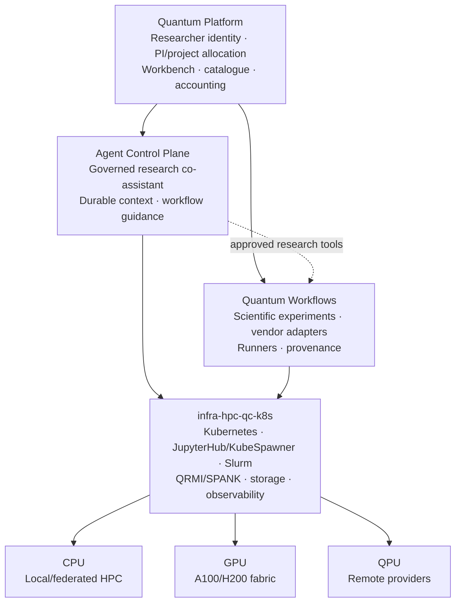

# Federated Quantum-Centric Research Computing Architecture

> **Status:** Architecture direction / ideation (8 October 2026). This is a target system map, **not** a statement that all QPU, GPU, vendor-account, MPI, agent or external federation connections are deployed.

This document captures the four-repository system design and boundaries. Keep [current verified operational state](current-platform-state-m3-m4.md) separate from future capabilities.

## The platform in one picture



The diagram is an *interaction* map rather than a claim that infrastructure is controlled by the higher-level applications. The repositories are peers with independent sources of truth:

| Owner | Authoritative responsibilities |
| --- | --- |
| `quantum-platform` | Human researcher identity; researcher/PI/programme/project allocations; catalogue; access grants; workbench UX; usage ledger |
| `agent-control-plane` | Canonical agent projects, conversations, memory, policy and approvals; bounded research assistance |
| `quantum-workflows` | Reproducible scientific code; independent vendor examples/adapters; environment definitions; result provenance |
| `infra-hpc-qc-k8s` | OpenStack hosts, Kubernetes, GitOps/Argo CD, storage, Slurm, network/security, deployment and telemetry |
| External QPU/cloud operators | Vendor account registration and authentication, underlying queue admission, device execution and provider charges |

## Adopt vendor-specific offerings first

**Do not require equivalent algorithms, SDKs or backends.** A catalogue item is an offering combining four independent concepts:

```text
Scientific workflow + versioned environment image + execution site + resource profile
```

Examples:

| Catalogue offering | Image family | Backend or site |
| --- | --- | --- |
| IBM Bell pair (CPU notebook) | `ibm-qiskit-cpu` | IBM Quantum Runtime or Aer CPU |
| IBM Aer CUDA simulation | `ibm-qiskit-aer-cuda` | Slurm A100/H200 |
| IBM Aer ROCm evaluation | `ibm-qiskit-aer-rocm` | validated AMD/ROCm device only |
| IQM superconducting Bell pair | `iqm-qiskit-cpu` | IQM remote QPU |
| Quantinuum Bell pair | `quantinuum-pytket-nexus` | Nexus provider job |
| Pasqal atom-array/pulse tutorial | `pasqal-pulser` | Pasqal emulator or QPU |
| PennyLane Lightning CPU/GPU | `pennylane-lightning-cpu` / `pennylane-lightning-cuda` | local CPU / Slurm GPU |
| MPI Ising / SQD postprocessing | `mpi-science-cuda` or dedicated scientific runner | approved Slurm GPU site |

These are illustrative *names*, not promises that published images already exist. GPU images are explicitly architecture/toolchain-specific: ROCm support must be built and tested separately; a CUDA image does not imply AMD compatibility. A workflow may support multiple images and a single vendor may require multiple mutually incompatible images.

Build each in `quantum-workflows` CI, publish immutable GHCR digests, verify software BOM and licenses, scan, test without hardware credits, and deliver through GitOps-managed catalog metadata. The Slurm side uses Apptainer images with tested MPI/CUDA/ROCm host compatibility. Do not make the notebook pod the custodian of a long-running provider job.

## Access federation, not vendor identity federation

Quantum Platform is **a one-stop portal** for catalogue discovery, local project approvals, self-service workbenches, execution, telemetry and results. It does **not** become the source of vendor login/registration or impersonate external identities.

Offer explicit credential/access modes:

1. **Institutionally managed allocation:** a designated administrator provisions IBM service instances/CRNs and access grants in IBM Cloud (or the corresponding institutional provision at another vendor), subject to its access rules. The portal stores *non-secret* resource references and local project authorisation. Where the vendor requires user invitations or personal tokens, that remains vendor-managed.
2. **Bring your own provider access:** a researcher independently registers with IBM/IQM/Pasqal/Quantinuum/another provider and may connect a permitted scoped token to the platform credential broker. The institution does not inherit management rights over that account.
3. **Local/simulator-only teaching:** no external QPU account or paid access needed; use versioned CPU/GPU images.
4. **External-site collaboration:** authorised execution-site adapter, preserving the other site's scheduler and policy.

Never create IBM or vendor users by inventing local usernames. Never share an organisation administrator token with researcher workloads. Local accounting is not automatically equal to authoritative provider billing.

For IBM specifically, distinguish *IBM Cloud account*, *IAM user*, *Quantum Compute Service instance identified by a CRN*, *instance access group*, *API key* and the *provider-controlled QPU queue*. An IBM administrator may manage instances and access groups within their account and role, but does not directly administer the physical global QPU queues. See:
- https://quantum.cloud.ibm.com/docs/en/guides/invite-and-manage-users
- https://quantum.cloud.ibm.com/docs/en/guides/access-groups
- https://quantum.cloud.ibm.com/docs/en/guides/access-instances-platform-apis

## Scheduling and release model

1. KubeSpawner gives each researcher a lightweight notebook/workbench and their persistent research home.
2. A typed Quantum Platform request binds a researcher, PI/project allocation, selected offering, environment digest and access mode.
3. Slurm obtains CPU/GPU allocations for finite preprocessing or postprocessing stages and releases them promptly.
4. Remote QPU APIs return durable provider job IDs, tracked by a persistent controller. The provider owns its queue; waiting must not hold an expensive GPU allocation.
5. QRMI/SPANK is an *optional supported route* for explicitly reserved QPU resources. It does not displace independent vendor SDKs.
6. Result arrival triggers fresh Slurm allocations for analysis, including MPI when worthwhile; provenance links provider-job, Slurm-job and result IDs.
7. ACP assists with preflight, explanation and guided troubleshooting under explicit tool grants; it does not become another scheduler.

Resource accounting must keep *requested*, *reserved*, *measured* and *billed* usage separate. Record the actual vendor job ID, actual instance/CRN reference, researcher and project allocation, container digest and site/Slurm identifiers.

## Scaling model: first one GPU, then one DGX, then multiple nodes

- Stage A: CPU Slurm smoke and a remote provider handshake, using independent tutorial images.
- Stage B: A100 allocated GPU simulation or postprocessing; validate GRES/TRES, `CUDA_VISIBLE_DEVICES`, image runtime and cleanup.
- Stage C: a single DGX with **8 × H200 GPUs on one node**; validate multi-GPU process binding and communication.
- Stage D: two or more *distinct* H200 nodes **only after** the site provides them and authorises a suitable Slurm/MPI or remote execution service. One eight-GPU DGX is not an eight-node cluster.
- MPI is for the classical part (distributed statevector, parameter sweeps, SQD, large-scale GPU analysis). It does not distribute a single remote QPU across nodes by itself.
- If Axis Atmos retains the remote execution authority, use an approved outbound authenticated execution gateway/adapter; do not assume site-wide root, Slurm control, routability, or unrestricted direct SSH.

## Direct research clients: keep the portal optional

Researchers may enter via web/Jupyter, OpenSSH/VS Code Remote-SSH, Emacs Spacemacs/TRAMP, an authorised CLI or ACP/gptel clients. All access should resolve to the **same Quantum Platform user, POSIX identity, project and shared research home**.

Proposed workflow:

```text
Researcher workstation
  |-- browser -> Quantum Platform -> JupyterHub/KubeSpawner
  |-- OpenSSH over approved VPN -> managed login node -> Slurm
  |-- VS Code Remote-SSH -> managed login node (not shared Slurm compute head)
  |-- Emacs TRAMP -> managed login node; gptel -> separate authorised ACP/model API
  +-- CLI/API -> same project and execution records

Login node -> sbatch/srun -> CPU/GPU
Workflow broker -> provider job ID -> remote QPU queue
```

User-facing portal convenience can generate a non-secret SSH configuration template; never generate or store a user's private SSH key server-side. Initial access remains approved WireGuard plus public-key SSH to designated login nodes. Later browser code-server/TUI/API options need their own security and per-user isolation reviews. Do not let shared login nodes become unrestricted inference or heavy-build machines. VS Code Remote-SSH installs its remote server on the selected SSH host; ensure that is consistent with host policy and software quotas.

## Open architecture decisions

- Provider onboarding: how to register entitlement, acceptance tests and immutable images for each provider.
- Credential broker: encrypted token references, token refresh support, audit, revocation and account-owner consent.
- Async job lifecycle: reconciliation, retries/idempotency, cancellations, queue timeouts and provider charges.
- GPU runtime portability: CUDA vs ROCm packages, arch/build matrix, driver compatibility, Apptainer/MPI ABI.
- MPI deployment: container/host MPI matrix and network fabrics, plus independent-site scheduler permissions.
- Catalog UX: distinguish scientific workflow, image, resource profile, access mode and live entitlements.
- ACP tools: typed read-only preflight first, require approval for consequential submissions.

## Related documents

- [Current operational handoff](current-platform-state-m3-m4.md)
- [Quantum Workflows scientific environments](https://github.com/nyameko/quantum-workflows/blob/dev/docs/ENVIRONMENTS.md)
- [Quantum Workflows architecture](https://github.com/nyameko/quantum-workflows/blob/dev/docs/ARCHITECTURE.md)
- [Agent Control Plane](https://github.com/nyameko/agent-control-plane/blob/dev/README.md)
- [Strangeworks Compute (comparative product reference)](https://strangeworks.com/technology/compute)

**Scope constraint:** documentation/architecture only. Deployment and account/provisioning changes require separate feature PRs with tests and explicit acceptance criteria.
